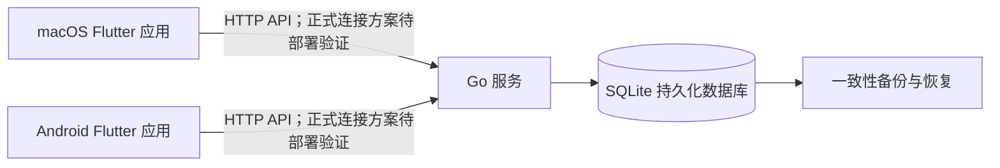

# CrossShow 开发文档 v0.1

文档日期：2026-09-14  
状态：首版开发基线草案，尚未开始实现。  
项目名称：暂用当前目录名 CrossShow，显示名称可后续调整。

## 1. 产品目标

构建仅供个人使用的时间安排应用，首版提供 macOS 和 Android 独立安装包，Windows 和 iOS 列入后续开发计划。通过用户已有的阿里云 Linux 服务器保存数据，实现各设备自动同步和手动刷新。

核心验收场景：在设备 A 创建事件，设备 B 打开应用或手动刷新后可看到同一事件；任一设备修改或删除后，其他设备在下次同步时获得结果。

## 2. 需求状态与范围

### 2.1 用户已确认

| 项目 | 要求 |
| --- | --- |
| 使用者 | 仅本人使用 |
| 首版平台 | macOS、Android |
| 后续平台 | Windows、iOS，保留为长期目标，不作为首版验收条件 |
| 交付 | 可安装的独立应用，不能使用 PWA |
| 服务端 | 已有阿里云 Linux 服务器，当前使用 IP，无域名 |
| 同步 | 打开应用、回到前台自动同步；支持手动刷新；无实时更新要求 |
| 离线 | 首版优先在线，离线编辑后联网提交延后 |
| 事件 | 管理具有确定时间的事件；课程也是事件 |
| 重叠 | 允许，初期并排展示 |
| 全天／跨天 | 都需要支持 |
| 备注 | 自由填写，可留空 |
| 重复 | 每天、工作日、每周、每双周，可设置重复次数（2026-09-15 变更：新增每天与工作日） |
| 批量修改 | 修改单次或后续重复，不修改过去内容 |
| 提醒 | 不需要 |
| 外部日历 | 暂不接入 |
| 访问保护 | 首版不做账号、登录和权限系统 |

### 2.2 本文采用的建议默认值

以下为可实施的设计默认值，不代表用户已逐项确认。后续可以调整。

- 客户端 Flutter / Dart，后端 Go，数据库 SQLite，Docker Compose 部署。
- 桌面默认周视图，手机默认当天列表；支持日期选择及回到今天。
- 重复次数包含首次，例如 16 次意味着总共生成 16 个事件。
- 重复事件操作文案为“仅本次”和“本次及以后”。
- 删除采用与修改相同的范围；批量删除前展示数量并确认。
- 首版重复事件必须是有限次数，建议范围 1–520 次。
- 默认时区 Asia/Shanghai；同一份日程在各端统一使用该日历时区展示，不随设备时区自动改变。
- 周一为一周起点；不单独设置地点、分类和事件颜色字段。
- 首版支持当天和周视图，小月历仅用于日期导航，不包含独立月事件网格。
- 首版暂不支持重设已有系列的周期／次数；可以删除后续并创建新系列。若需要直接调整，另行补充规则。

### 2.3 首版不包含

待办任务、自动排程、提醒通知、外部日历互通、多人共享、报名预约名额、支付、账户权限、离线写入队列、WebSocket、无限重复、节假日规则、单双教学周、拖拽调整时间、应用内自动更新。

“每双周”表示从首次日期开始每隔两周，不等同于学期的单周／双周。

## 3. 技术架构



### 3.1 客户端

使用一个 Flutter 项目，首版维护 macOS 和 Android 平台工程，后续增加 Windows 和 iOS。共享数据模型、API 调用、编辑流程和大部分界面组件，通过窗口宽度选择紧凑或宽屏布局。

建议按功能组织代码，分离界面、应用逻辑和数据访问。通过 Repository 隔离网络层，后续加入本地数据库时无需重写界面。

Flutter 状态管理、HTTP 和日期库在项目初始化时选择并锁定版本。避免在文档阶段绑定未经目标平台验证的第三方日历组件；先验证其全天、跨天及重叠能力，不满足时自行实现时间网格。

### 3.2 后端

一个 Go 服务负责 REST API、输入校验、系列展开、版本检查和数据库事务。首版单进程部署，不使用 Redis、任务队列或分布式服务。

日程计算和校验以服务端为准，客户端只负责即时输入反馈和展示，避免各端重复规则不一致。

### 3.3 数据库

SQLite 适合本项目的单用户、小规模数据。启用外键约束、WAL 和合理的 busy timeout，持久化存储放在本机磁盘目录。单实例负责写入；发生短暂锁等待时返回可重试错误，不丢弃写入。

数据库升级使用有序迁移脚本，记录 schema 版本。每次升级前备份，不默认支持降级后的旧程序读取新版 schema。

### 3.4 工程目录建议

```text
crossshow/
  apps/client/                 # Flutter 项目，首版含 macOS / Android 平台目录
    lib/features/calendar/
    lib/features/event_editor/
    lib/features/settings/
    lib/core/network/
    lib/core/models/
  server/
    cmd/api/
    internal/http/
    internal/events/
    internal/storage/
    migrations/
  api/openapi.yaml             # API 契约
  deploy/                      # Dockerfile、Compose、配置示例
  docs/                        # 开发、部署、测试与使用文档
```

## 4. 界面与交互

### 4.1 宽屏布局

左侧日期导航，主体为周时间网格，顶部包含当前日期范围、今天、前后翻页、创建和刷新按钮。事件编辑使用面板或弹窗。窗口收窄时切换紧凑布局。

### 4.2 紧凑布局

默认当天列表，顶部日期导航与今天按钮，提供周视图切换和新建按钮。列表内容不足一屏时也能下拉刷新。周视图手势与下拉刷新分开处理，避免滚动冲突。

### 4.3 事件编辑

- 标题：必填，去除首尾空白后 1–200 字符。
- 全天开关。
- 普通事件：开始日期时间、结束日期时间。
- 全天事件：开始日期、最后一天，界面均使用包含式日期。
- 备注：可空，最多 10,000 字符，按普通文本显示。
- 创建时选择不重复／每周／每双周；重复时填写总次数。
- 重复事件保存前选择修改范围。

保存时禁用重复点击；成功后关闭编辑器并更新列表；失败时保留当前输入。切回前台刷新不得覆盖打开中的编辑表单。

### 4.4 时间布局

采用半开区间 `[start, end)`：一个事件恰好结束时另一个开始，不算重叠。

按天切分普通事件的显示片段；同一天内将相互关联的重叠事件分组，再为每组分配列。稳定排序使用开始时间、结束时间和事件 ID。首版每组等宽分列，点击小事件可打开完整信息。

全天事件在独立区域显示。跨天普通事件在每天网格内显示片段并标记延续关系；每个片段指向相同事件 ID。

## 5. 时间与重复事件语义

### 5.1 存储与边界

普通事件保存 UTC 开始／结束时间以及 IANA 时区。要求结束晚于开始。全天事件保存开始日期和不包含的结束日期，不转换为 UTC 午夜。

例：界面填写 9 月 14 日至 9 月 16 日的全天事件，接口保存 `start_date=2026-09-14`、`end_date_exclusive=2026-09-17`。

每周／双周按日历时区的本地日期递增 7／14 天，不简单增加固定 UTC 秒数。每天按本地日期递增 1 天；工作日跳过周六与周日（如周五的下一次发生为周一）。服务端打包时包含时区数据。首版默认上海时区；如未来开放其他时区，必须补充夏令时不存在或重复时间的处理规则。

### 5.2 有限实例方案

创建重复系列时，在一个事务中生成指定次数的独立事件，使用同一个 series_id 关联，并保留 occurrence_index。普通事件没有 series_id。

优点是查询、单次修改和删除简单，修改过去记录的边界直观。代价是增加行数，后续调整周期需要明确重建规则；本项目的有限次数与规模可以接受。

### 5.3 “本次及以后”的精确定义

目标集合为同系列中 occurrence_index 不小于选中事件、尚未删除且未结束的事件。是否已结束由服务端当前时间和事件的结束时间判断；全天事件按日历时区的结束日期边界判断。进行中的事件未结束，可以被选中并参与批量修改，即支持修改当前及后续任务。

选择已结束的事件时，仅允许“仅本次”；批量操作从一个未结束的实例发起。这样批量修改不会意外改变过去记录。直接编辑某个历史实例仍可用“仅本次”。这些边界属于本文建议默认值。（2026-09-15 变更：应使用需求，将原“进行中视为已开始、不参与批量修改”放宽为“进行中可选中并参与批量修改”，保护边界由“已开始”改为“已结束”。）

批量修改仅传播实际改变的字段：

- 标题／备注：将目标集合对应字段设为新值。
- 普通事件开始时间：计算选中实例新旧本地日期时间的差，应用到各目标；按日历时区计算。
- 普通事件时长：只有用户改变时长时才统一采用新时长；否则各实例保留原时长。
- 全天日期：按日期偏移修改；天数发生变化时统一采用新天数。
- 单次例外仍属于系列；后续批量修改会覆盖例外中本次涉及的字段，未修改的字段保持原值。
- 首版已有系列不支持批量切换全天类型，避免隐式时间转换；单次可以切换。

提交前由服务端预览目标数量、版本和截止时间，再在事务内确认。若有目标已开始、版本改变或成员变化，预览失效，要求重新预览。不得部分保存。

重复总次数代表最初创建的数量；删除单次不会补生成一个新实例，序号不重新排列。

## 6. 数据模型

### 6.1 event_series

| 字段 | 说明 |
| --- | --- |
| id | UUID |
| interval_weeks | 1 或 2 |
| occurrence_count | 初始生成次数，建议 1–520 |
| timezone | 系列生成时区 |
| version | 系列变更版本，任一成员写入时增加 |
| created_at / updated_at | UTC 时间 |

### 6.2 events

| 字段 | 说明 |
| --- | --- |
| id | UUID |
| series_id | 可空，关联系列 |
| occurrence_index | 系列内从 0 开始的原始序号 |
| title / notes | 标题、备注；备注默认空字符串 |
| all_day | 是否全天 |
| start_at / end_at | 普通事件 UTC 时间；全天为空 |
| start_date / end_date_exclusive | 全天日期；普通事件为空 |
| timezone | 日历时区 |
| version | 从 1 开始，每次写入增加 |
| created_at / updated_at | UTC 时间 |
| deleted_at | 软删除时间，可空 |

数据库约束保证普通时间字段和全天字段互斥，起止范围合法。系列 ID 和序号建立唯一约束；时间字段及 series_id 建立查询索引。

### 6.3 辅助数据

- schema_migrations：数据库迁移记录。
- idempotency_records：写请求唯一键、请求摘要与结果，解决网络重试造成重复创建；首版不自动清理。
- 服务配置：监听地址、数据库路径、默认时区；不写入客户端代码。
- 客户端配置：服务器 URL、当前视图等；首版不承担权威日程存储。

## 7. API 契约草案

统一前缀 `/api/v1`，JSON 编码，UTC 时间使用 RFC 3339，日期使用 `YYYY-MM-DD`。具体字段以实施阶段的 OpenAPI 文件为准。

| 方法与路径 | 用途 |
| --- | --- |
| GET /healthz | 进程存活状态 |
| GET /api/v1/config | 日历时区与支持能力 |
| GET /api/v1/events?from=…&to=… | 获取日期范围内所有相交事件 |
| GET /api/v1/events/{id} | 单个事件及系列信息 |
| POST /api/v1/events | 创建单次或有限重复事件 |
| PATCH /api/v1/events/{id} | 仅修改本次，携带 expected_version |
| DELETE /api/v1/events/{id}?expected_version=… | 仅删除本次 |
| POST /api/v1/events/{id}/series-change-preview | 预览本次及以后修改／删除 |
| POST /api/v1/events/{id}/series-change-commit | 按预览令牌提交事务 |

所有写请求携带 `Idempotency-Key`。相同键和请求返回原结果；相同键配不同内容返回冲突。幂等记录和业务变更在同一事务中保存。

范围查询的 from 包含、to 不包含，按日历时区的日期解释。普通事件与转换后的时间窗口相交即返回；全天事件按日期相交判断。首版限制单次查询跨度不超过 93 天，返回整个窗口的完整结果，不做静默截断。

创建普通重复事件示例：

```json
{
  "title": "课程",
  "notes": "带上教材",
  "all_day": false,
  "start_at": "2026-09-14T01:00:00Z",
  "end_at": "2026-09-14T02:30:00Z",
  "timezone": "Asia/Shanghai",
  "repeat": { "interval_weeks": 1, "count": 16 }
}
```

创建返回 201 和生成的事件 ID 列表。查询返回事件 version、series_version 与 server_time。批量预览返回受影响数量、服务端生成的操作摘要和有时效的令牌；提交不得用新内容替换令牌绑定的内容。

错误格式统一为 `{"error":{"code":"VERSION_CONFLICT","message":"事件已被其他设备修改","details":{}}}`。

使用 400 表示输入错误，404 表示不存在／已删除，409 表示版本或预览冲突，500 表示内部错误，503 表示临时不可用。客户端不得把请求失败显示为空日程。

## 8. 同步与失败处理

- 首次打开、从后台返回、手动刷新、切换至未加载日期范围时读取服务器。
- 前台恢复事件合并去抖，避免连续发起相同请求；不使用后台定时同步。
- 修改成功后重新获取受影响窗口；移出当前窗口的事件也必须从旧窗口移除。
- 查询响应仅替换其对应窗口；过期请求响应不得覆盖新的查询或写入结果。
- 读请求可自动重试；写请求重试必须复用原幂等键。
- 409 时保留用户输入，展示服务器新版本，由用户核对后再次保存，不静默覆盖。
- 断网时可保留本次会话已加载内容并标注连接失败；不承诺重启后离线查看或离线保存。
- 首版编辑失败后的草稿只保证当前编辑会话保留，不保证进程退出后恢复。
- 手动刷新成功显示最近成功同步时间，失败显示原因和重试入口。

## 9. 部署、连接与数据维护

### 9.1 服务部署

建议 Compose 管理一个应用容器，挂载持久化数据目录。数据库不独立开放端口。配置监听端口、默认时区和日志等级，使用健康检查与退出时的优雅关闭。

部署前核实服务器 CPU 架构、Linux 发行版、可用内存、Docker 环境和安全组端口；目前这些信息未知。

### 9.2 IP 与传输

服务器 URL 通过设置页输入，不写死 IP。无域名不妨碍后端开发，但正式版必须在真机验证 HTTPS／证书信任与平台网络策略。不能将“使用 IP”视为天然具备可信加密连接，也不能默认关闭证书校验。

局域或开发环境可以使用明确标记的 HTTP 开发配置。正式部署的 IP 证书或其他连接方案在部署阶段核实后单独记录，尚未作技术承诺。

按用户要求首版不实现登录权限；这意味着公网可达的无鉴权接口可被其他访问者读写。HTTPS 只保护传输，不提供身份授权。本文不据此增加账户功能。

### 9.3 备份与恢复

使用 SQLite 一致性备份机制，不直接仅复制运行中启用 WAL 的主数据库文件。建议每天备份，保留最近 14 份，并定期复制到服务器之外。

恢复步骤：停止服务、保存当前故障库、恢复备份、执行完整性检查、启动匹配 schema 的程序、核对事件数量和抽样日期。正式使用前完成至少一次恢复演练。

日志记录请求 ID、路径、状态、耗时和错误码，默认不记录事件标题、备注或完整请求体。备份导出不等同于 ICS 外部日历互通。

## 10. 分阶段构建与交付

| 平台 | 构建环境 | 交付阶段与验证 |
| --- | --- | --- |
| macOS | macOS + Xcode 工具链 | 首版：.app，可后续封装 DMG；验证启动和网络 |
| iOS | macOS + Xcode | 后续：确定设备安装及签名方式，完成真机验证 |
| Windows | Windows + 对应桌面构建工具 | 后续：应用及依赖打包，验证运行与安装流程 |
| Android | Flutter + Android SDK | 首版：APK，验证安装与网络 |

共享代码不代表能在一台 Mac 上直接完成全部平台打包。Windows 需要 Windows 机器或构建执行器。iOS 签名、个人设备安装和后续更新方式在 iOS 阶段确认，不能以模拟器运行代替交付。

首版手动安装更新，客户端显示版本号；后端 API 保持 `/api/v1` 兼容，不兼容时明确提示升级。具体 Flutter／Go／SDK 版本在初始化时锁定并写入环境文档。

## 11. 实施阶段与验收

### M0：工程与平台可行性

建立目录和工具链；在 macOS 和 Android 完成空应用构建验证；建立 Go 服务及数据库迁移。Windows 和 iOS 工具链不阻塞首版开发。

验收：平台支持不是仅凭框架声明，项目工程具备可重现的构建命令；暂缺设备时明确记录未验证项。

### M1：单次事件与跨端同步

完成服务器设置、当天列表、单次事件 CRUD、前台自动刷新、手动刷新、版本冲突及幂等写入。

验收：至少两台设备互相创建／修改／删除可见；请求失败不丢失当前表单；重复提交不重复创建。

### M2：时间布局

完成桌面周视图、手机周视图切换、日期导航、重叠分列、全天和跨天显示。

验收：相邻事件不误判重叠，跨天片段均能打开原事件；窄窗口及手机无阻塞操作的溢出。

### M3：重复事件

完成有限次数生成、单次编辑、后续批量编辑／删除、预览和事务提交。

验收：次数准确，双周间隔正确，过去记录不被批量修改，并发修改或开始时间跨界使旧预览失效。

### M4：部署与 macOS / Android 交付

部署阿里云服务、验证正式连接、配置备份并演练恢复，完成 macOS 和 Android 实际运行验收和安装说明。

验收：macOS 和 Android 能安装并连接同一服务；重启服务数据不丢失；备份可恢复；已知限制有记录。

### M5：后续 Windows / iOS 扩展

在首版稳定后增加 Windows 和 iOS 平台工程及必要的平台适配，复用已有数据模型、API 和同步逻辑。具体先后顺序与交付时间后续确定。

Windows 阶段准备构建环境并验证桌面布局、安装和网络；iOS 阶段确定签名与设备安装方式，验证触屏交互、网络和前后台切换。各端通过与首版相同的日程与同步验收后再交付。

首版选择依赖时核查后续平台支持，平台专用代码保持隔离；不提前实现后续平台专属功能。

## 12. 测试重点

| 类别 | 必测场景 |
| --- | --- |
| 事件校验 | 空标题、非法时间、结束早于开始、合法跨天 |
| 日期边界 | 月末、年末、闰日、午夜结束、全天多日 |
| 重复 | 1 次、16 次、每天、工作日（跨周末）、每双周、最大次数、非法类型、非法次数 |
| 单次例外 | 修改／删除某次不影响其他实例，不自动补次数 |
| 批量 | 不改变过去、字段传播、预览过期、整批回滚 |
| 冲突 | 两设备编辑同版本、修改与删除竞争、系列成员变化 |
| 网络 | 超时重试无重复、写成功响应丢失、旧查询晚到、刷新失败 |
| 布局 | 两事件重叠、链式重叠、跨天、全天与普通事件并存 |
| 持久化 | 容器重启、迁移、数据库繁忙、备份恢复 |
| 平台 | 首版在 macOS 和 Android 验证安装启动、IP 连接、前后台切换、手动刷新；后续平台加入时复用这些验收项 |

后端以规则单元测试和真实临时 SQLite 的集成测试为主；客户端测试关键布局与同步状态，首版在 macOS 和 Android 补充人工真机／桌面验收。不要求每个简单 UI 字段都有单独测试。

## 13. 待核实事项与变更管理

首版实施前核实服务器环境及 macOS / Android 开发工具安装情况；正式部署前确定可信连接方案。iOS 安装方式、Windows 构建资源在对应后续阶段核实。

第 2.2 节默认值和第 5.3 节批量编辑边界作为开发建议，其中周期／次数重设、已开始事件处理和例外覆盖规则如需调整，应先更新本文及 API 契约，再修改实现。

本文件是规划文档，不表示任何代码、部署、打包或验证已完成。

## 14. 技术依据

- Flutter / Dart 多平台应用说明：https://dart.dev/multiplatform-apps
- Flutter 各目标平台开发环境：https://docs.flutter.dev/install/custom
- Flutter 网络访问说明：https://docs.flutter.dev/data-and-backend/networking

以上资料用于平台可行性参考；依赖版本、打包细节与平台网络配置在实际初始化和交付时按官方资料核实。
